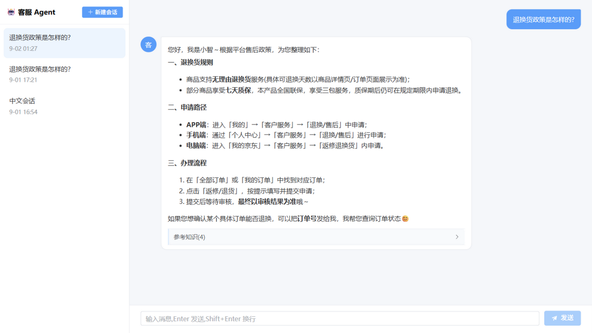
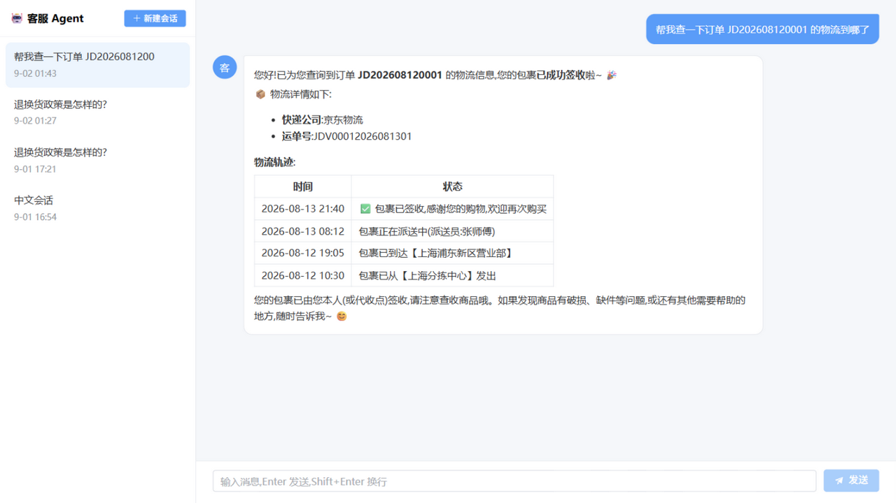
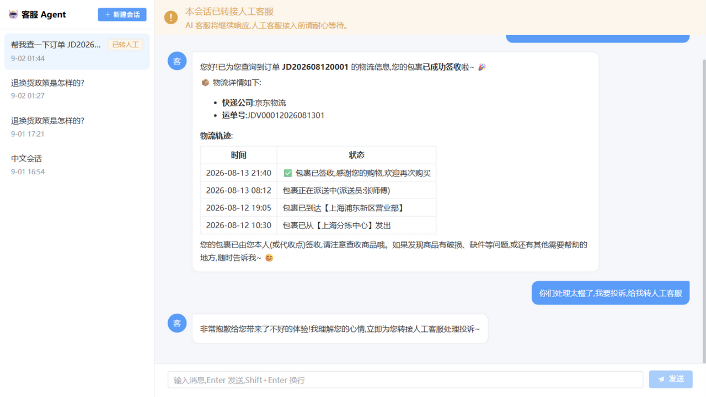

# 客服 Agent

智能客服机器人 MVP:RAG 知识库问答 + 多轮对话(上下文连续)+ 工具调用(订单/物流/转人工)+ Web 会话管理界面。

## 效果展示

**RAG 知识库问答** —— 检索知识库后作答,回答附引用来源与相关度:



**订单/物流工具调用** —— Agent 自动调用查询工具,以表格结构化返回物流轨迹:



**转人工** —— 识别投诉意图后标记转接人工,会话打上「已转人工」徽标并显示横幅:



## 技术栈

| 层 | 选型 |
|---|---|
| Agent 编排 | [Pydantic AI](https://ai.pydantic.dev/) 2.x(工具调用、message_history 上下文) |
| LLM / Embedding | 智谱 GLM(`glm-5.3-flash` 混合推理 / `embedding-3` 1024 维,OpenAI 兼容端点) |
| RAG | [LlamaIndex](https://www.llamaindex.ai/)(切分、索引、检索)+ BM25 混合检索(rank-bm25/jieba)+ 交叉编码器重排(智谱 rerank API) |
| 向量库 | Chroma 1.x(本地持久化) |
| 后端 | FastAPI + SQLite(aiosqlite),SSE 流式输出 |
| 前端 | Vue 3 + Vite + Element Plus(markdown-it + highlight.js 渲染) |

## 架构

```
Vue 前端 ──SSE──> FastAPI ──> Pydantic AI Agent ──┬─> glm-5.3-flash(生成)
                          │                      ├─> retrieve_knowledge ──> 查询拆分子 agent(结构化输出)
                          │                      │      分点混合检索:BM25(jieba)×向量(Chroma)
                          │                      │      逐点重排 → 原句锚定 + 拆分点新块补位 → 上下文
                          │                      ├─> get_order_status / get_logistics ──> data/mock/orders.json
                          │                      └─> escalate_to_human(转人工标记)
                          └─> SQLite(会话 + 消息;每轮加载全部历史作为 message_history)
```

检索质量:50 题固定种子评测,Recall@5 从纯向量基线的 0.72 提升到 **0.96**(目标 ≥0.95),
top-1 准确率 0.52 → 0.84。设计路线、超参调优方法与完整结果台账见
[docs/rag-hybrid-design.md](docs/rag-hybrid-design.md);复现命令:

```bash
cd backend
uv run python scripts/eval_rag.py --json    # 检索评测(50 题,Recall/Precision/MRR)
uv run python scripts/tune_rag.py           # 检索超参网格搜索
```

## 快速开始

前置:Python 3.13+ 与 [uv](https://docs.astral.sh/uv/)、Node 18+、[智谱 API Key](https://bigmodel.cn)(注册免费)。

```bash
# 1. 后端
cd backend
uv sync
cp .env.example .env      # 编辑 .env,填入 ZHIPU_API_KEY

# 2. 构建知识库(下载 JDDC 语料 → 抽取 QA 对 → 建索引)
uv run python scripts/prepare_dataset.py
uv run python scripts/ingest.py

# 3. 启动后端(端口 8000)
uv run uvicorn app.main:app --port 8000 --reload

# 4. 前端(新终端)
cd frontend
npm install
npm run dev               # 打开 http://localhost:5173
```

测试订单号(演示"查订单/查物流"工具):`JD202608120001`、`JD202608180023`、`JD202608250117`、`JD202608300242`。

## 无 Key 干跑模式(开发自测)

没有 API Key 时,可以把 `.env` 里 `EMBED_FAKE=1`,并用 `uv run python scripts/ingest.py --fake --reset` 重建索引:检索全链路可用(伪向量,仅验证流程),**对话仍需真实 Key**。

## 知识库数据

- 来源:[JDDC 京东电商客服语料](https://github.com/SimonJYang/JDDC-Baseline-Seq2Seq) 官方基线仓库自带的脱敏子集 `data/chat.txt`(约 6,600 组真实客服会话)。
- 处理:`scripts/prepare_dataset.py` 抽取问答对、清洗表情占位符与寒暄、按信息量裁剪到 2,500 条,输出 `backend/data/raw/kb.jsonl`。
- **许可:仅用于学习/研究演示,不得商用。**

## 常见问题

- **chromadb 中文路径 bug(重要)**:chromadb 1.5.9 在 Windows 上,持久化目录若是**含中文的绝对路径**,写入正常但重新打开报 `Error loading hnsw index`。本项目已在 `app/config.py` 用「相对路径 + chdir」规避,**不要把 `CHROMA_PATH` 改回绝对路径**。
- 知识库为空时,对话接口会返回明确错误提示,按提示先跑 `prepare_dataset.py` + `ingest.py`。
- 换 embedding 模型或维度后必须重建索引:`uv run python scripts/ingest.py --reset`。
- Git Bash 下 curl 内联中文会因编码问题导致 400,属终端显示问题,浏览器/前端不受影响。

## 目录结构

```
backend/
  app/
    config.py        # 环境变量与路径(chroma 相对路径约束在此)
    models.py db.py  # SQLite ORM:会话/消息
    schemas.py       # Pydantic API 模型
    agent.py         # Pydantic AI 客服 Agent + 4 个工具
    api.py           # 会话 CRUD + SSE 对话
    rag/
      embeddings.py  # 智谱 embedding-3 / FakeEmbedding
      retriever.py   # 检索入口:hybrid(默认)/ dense 分发
      hybrid.py      # BM25×向量混合检索 + 融合 + 交叉编码器重排
  scripts/
    prepare_dataset.py   # JDDC 下载与清洗
    ingest.py            # 建向量索引(--fake / --reset)
    eval_rag.py          # 检索评测(50 题,Recall/Precision/MRR,--decompose 分点模式)
    tune_rag.py          # 检索超参网格搜索
    eval_compound.py     # 多意图复合问题检索对比
  data/
    mock/orders.json     # 演示订单
    raw/  chroma/        # 生成物(不入库)
frontend/
  src/
    api.js store.js      # API 封装 + 全局状态
    App.vue / components # 布局、会话侧栏、聊天窗、消息气泡
```
